# Architecture Spine — CreditOS

## Design Paradigm

CreditOS usa **DDD + Hexagonal Architecture + Event-Driven Microservices**.

- Cada microsserviço representa um bounded context ou capacidade de domínio com linguagem e ownership próprios.
- O domínio fica isolado de frameworks, banco de dados, transporte, provedores externos e formatos de payload de terceiros.
- Entradas externas e internas chegam por adapters; casos de uso vivem na camada de aplicação; regras e invariantes vivem no domínio.
- Comunicação síncrona interna usa gRPC.
- Fluxos assíncronos usam NATS JetStream como backbone de referência.

## Verified Technology Baseline

| Tecnologia | Baseline arquitetural |
| --- | --- |
| CloudEvents | especificação estável v1.0.2; eventos usam `specversion: "1.0"` |
| AsyncAPI | versão 3.1.0 como baseline para contratos assíncronos |
| SLSA | v1.2 como framework de referência; alvo inicial Build L2 e evolução para L3 conforme AD-23 |
| OAuth/OIDC | OAuth 2.0 Security BCP/RFC 9700 como baseline de segurança |
| Python | Python 3.13 como baseline de runtime backend; Python 3.14 só após matriz CI verde |
| FastAPI | framework padrão para APIs públicas HTTP/JSON |
| Pydantic | Pydantic v2 como baseline de validação, DTOs e schemas de borda |
| SQLAlchemy/Alembic | SQLAlchemy 2.x + Alembic 1.x para persistência e migrations PostgreSQL |
| gRPC Python | `grpcio`/`grpc.aio` + protobuf para chamadas internas síncronas |
| NATS JetStream | backbone assíncrono durável com cluster, streams críticos R3, backup/restore e operação conforme AD-21 |
| uv | workspace Python com lock único como base de monorepo |
| GitHub Actions | CI oficial do MVP, com OIDC para AWS e artefatos/proveniência conforme AD-23 |
| Argo CD | GitOps pull-based oficial para deploy no EKS conforme AD-23 |
| Amazon ECR | registry privado para imagens OCI, assinaturas, SBOMs, attestations e scan conforme AD-23 |
| Sigstore/Cosign | assinatura keyless de imagens e artefatos por identidade OIDC conforme AD-23 |
| Kyverno | admission policy inicial para EKS, incluindo verificação de imagem/attestation conforme AD-23 |
| Istio Ambient Mesh | baseline de service mesh para mTLS e autorização service-to-service no EKS |
| EKS Pod Identity | baseline para permissões IAM de workloads que acessam serviços AWS |
| S3 Object Lock | WORM de referência para exportações e checkpoints de auditoria, segmentado por Compliance/Governance/Legal Hold conforme AD-19 |
| OpenFeature | abstração vendor-neutral para feature flags conforme AD-22; fornecedor/control plane fica para ADR posterior |

## Invariants & Rules

### AD-1 — Paradigma arquitetural [ADOPTED]

- **Binds:** todos os serviços backend, contratos internos, integrações externas e persistência.
- **Prevents:** serviços acoplados por infraestrutura, domínio dependente de framework, microsserviços por camada técnica e divergência entre padrões síncronos/assíncronos.
- **Rule:** todo backend deve seguir DDD + Hexagonal Architecture + Event-Driven Microservices; domínio não depende de infraestrutura; gRPC cobre chamadas síncronas internas; NATS JetStream cobre fluxos assíncronos duráveis.

### AD-2 — Mapa de serviços e ownership de domínio/dados [ADOPTED]

- **Binds:** decomposição do primeiro deploy, ownership de dados, limites de comunicação e responsabilidades por serviço.
- **Prevents:** duplicidade de responsabilidade entre serviços, acesso direto a dados de outro domínio, serviço técnico sem fronteira de domínio e divergência na alocação de capacidades.
- **Rule:** o primeiro deploy possui exatamente sete microsserviços de domínio: `Identity & Tenant`, `Proposal Intake`, `Decision`, `Automated Review`, `Integration`, `Audit & Evidence` e `Reporting & Insights`. Cada serviço possui dados próprios e fronteiras explícitas. Comunicação cross-service só ocorre por gRPC, eventos NATS JetStream ou projeções autorizadas.

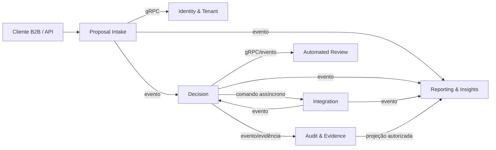

| Serviço | Ownership |
| --- | --- |
| `Identity & Tenant` | tenants, clientes técnicos, usuários, roles, permissões, claims, catálogo de tenant e tier de isolamento |
| `Proposal Intake` | submissão, schema, validação, normalização, idempotência, proposta recebida e status inicial |
| `Decision` | políticas, versões, execução determinística, decisão, códigos de motivo, inconclusivos e termos aprovados |
| `Automated Review` | revisão consultiva por IA, lacunas, inconsistências, guardrails e versões de agente/modelo |
| `Integration` | adapters externos, jobs assíncronos, fan-out/fan-in, retries, DLQ, fallback, resultados e custos de integração |
| `Audit & Evidence` | auditoria oficial, evidências, hash encadeado, checkpoints, exportação imutável e consultas auditáveis |
| `Reporting & Insights` | projeções, funil, dashboards, métricas de negócio, custos agregados e visão customer-facing curada |

| Conceito | Fonte de verdade |
| --- | --- |
| Tenant, cliente técnico, usuário, role, scope e tier de isolamento | `Identity & Tenant` |
| Proposta recebida, schema aceito, idempotência e status de intake | `Proposal Intake` |
| Política publicada, execução determinística, decisão final, termos aprovados e códigos de motivo | `Decision` |
| Job externo, adapter, resultado canônico de integração, DLQ, tentativas e custo de provedor de dados/notificação | `Integration` |
| Revisão consultiva por IA, versão de agente/modelo/prompt e evidência consultiva | `Automated Review` |
| Trilha oficial de auditoria, evidência, hash, checkpoint e exportação imutável | `Audit & Evidence` |
| Funil, agregados, dashboards e visão customer-facing curada | `Reporting & Insights`; projeções não são fonte de verdade transacional |

### AD-3 — Ownership de dados e persistência cross-service [ADOPTED]

- **Binds:** persistência, migrations, repositories, integrações internas, reporting, auditoria e fluxo de decisão.
- **Prevents:** banco compartilhado como contrato implícito, queries diretas entre domínios, transações distribuídas, duplicidade de dono de entidade e acoplamento silencioso entre equipes.
- **Rule:** cada microsserviço é dono exclusivo do seu modelo persistido e das suas mutações. No MVP, PostgreSQL pode ser compartilhado apenas como infraestrutura física, desde que cada serviço tenha database/schema/usuário separados. Joins, queries e transações diretas cross-service são proibidos. Estado entre serviços circula somente por gRPC, eventos NATS JetStream, outbox/inbox ou projeções autorizadas.

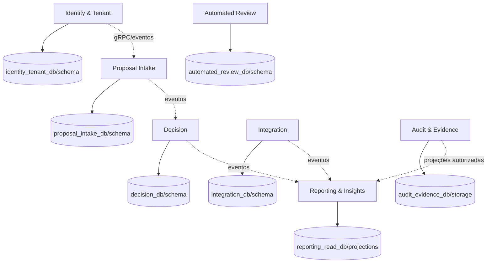

| Serviço | Persistência própria | Regra de acesso |
| --- | --- | --- |
| `Identity & Tenant` | tenants, usuários, clientes técnicos, roles, permissões, claims, catálogo de tenant | fonte confiável de identidade/tenant; demais serviços consultam por gRPC ou contexto autenticado |
| `Proposal Intake` | propostas recebidas, schemas, idempotência, status inicial | não expõe banco; publica eventos de submissão/status |
| `Decision` | políticas, versões, decisões, códigos de motivo, termos aprovados | mutação de decisão pertence ao serviço; evidências vão para `Audit & Evidence` |
| `Automated Review` | revisões consultivas, versões de agente/modelo, guardrails, resultados | não decide crédito final; retorna recomendação consultiva por contrato |
| `Integration` | jobs, adapters, retries, DLQ, snapshots/referências, custos de integração | não vaza payload bruto; normaliza via anti-corruption layer |
| `Audit & Evidence` | eventos append-only, evidências, hashes, checkpoints, exportações | trilha oficial; acesso reforçado e auditado |
| `Reporting & Insights` | projeções e agregações de leitura | não consulta bancos transacionais diretamente |

### AD-4 — Modelo de comunicação síncrona e assíncrona [ADOPTED]

- **Binds:** contratos públicos, contratos internos, schemas de produto, eventos, callbacks, integrações externas, reporting, auditoria derivada, workers e orquestrações assíncronas.
- **Prevents:** uso arbitrário de HTTP/gRPC/eventos, payload público arbitrário, comandos disfarçados de eventos, filas sem contrato, consumidores não idempotentes e acoplamento temporal indevido entre serviços.
- **Rule:** contratos públicos de proposta usam schemas versionados e aprovados; o MVP suporta CPF e CNPJ para crédito pessoal, BNPL, crédito PJ/capital de giro e recebíveis por contrato canônico com extensões governadas por produto, sem payload arbitrário. Chamadas internas que exigem resposta imediata e deadline curto usam gRPC. Fluxos que exigem desacoplamento, durabilidade, fan-out, retry, DLQ, replay, callbacks, reporting ou integração externa usam NATS JetStream. Eventos usam CloudEvents; contratos assíncronos usam AsyncAPI; publicação confiável usa transactional outbox; consumo confiável usa inbox/idempotência.

| Necessidade | Mecanismo |
| --- | --- |
| Consulta interna imediata | gRPC |
| Comando interno com resposta obrigatória e deadline curto | gRPC |
| Fato de domínio já ocorrido | Evento CloudEvents no NATS JetStream |
| Job/comando assíncrono | Mensagem no NATS JetStream com contrato AsyncAPI |
| Integração externa paralelizável | Comando assíncrono + fan-out/fan-in no NATS JetStream |
| Callback/webhook com retry | Job assíncrono no NATS JetStream |
| Projeção para dashboards | Evento consumido pelo `Reporting & Insights` |
| Auditoria oficial | `Audit & Evidence`; eventos não substituem trilha oficial |
| Proposta pública | schema versionado aprovado para CPF/CNPJ e produtos MVP; extensões por produto são governadas |

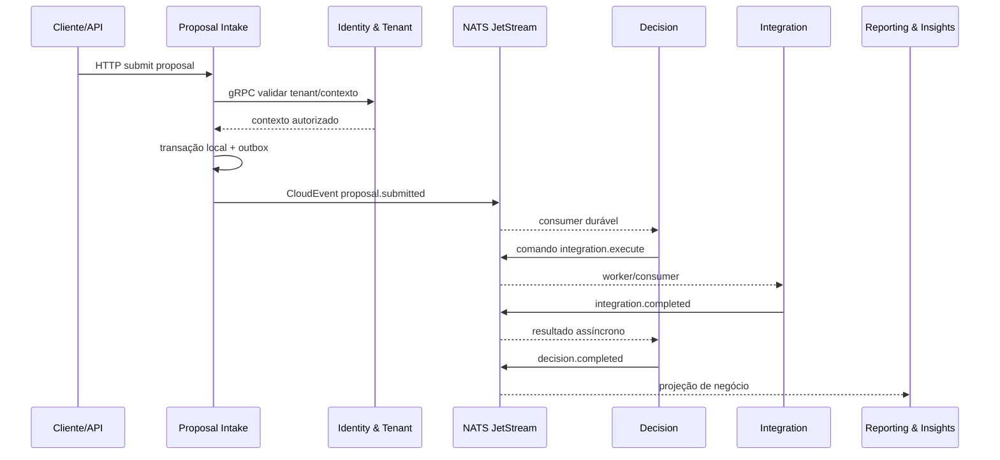

| Padrão | Convenção |
| --- | --- |
| Envelope | CloudEvents v1.0.2 com `specversion: "1.0"`, `id`, `source`, `type`, `subject`, `time`, `datacontenttype`, `dataschema` e `data` |
| Extensões CloudEvents | atributos sem underscore e em conformidade com a especificação, como `tenantid`, `correlationid`, `idempotencykey`, `schemaversion` e `traceparent` |
| Documentação | AsyncAPI 3.1.0 para eventos e comandos assíncronos |
| Publicação | transactional outbox por serviço produtor |
| Consumo | inbox/idempotência por consumidor e ack explícito |
| Ordenação | por chave de agregado quando necessário, preferencialmente `proposal_id` |
| Falhas | retry com limite, DLQ, alerta e reprocessamento controlado |
| Sensibilidade | sem payload sensível bruto em mensagens por padrão |

### AD-5 — Multi-tenancy e isolamento por tenant [ADOPTED]

- **Binds:** autenticação, autorização, tenant catalog, dados persistidos, eventos, gRPC metadata, cache, filas, storage, logs, métricas, traces, jobs, callbacks, dashboards e integrações externas.
- **Prevents:** tenant spoofing via payload, vazamento cross-tenant, isolamento inconsistente entre serviços, evolução ad hoc para tenants dedicados e uso de recursos compartilhados sem chave de tenant.
- **Rule:** o MVP usa modelo `bridge`: serviços compartilhados com dados e recursos críticos isolados por tenant ou grupo controlado de tenants conforme AD-20. O `tenant_id` confiável vem de autenticação/contexto e do catálogo do `Identity & Tenant`, nunca do body sem validação. `tenant_id` e `tenant_isolation_tier` devem propagar por gRPC metadata, CloudEvents, logs, métricas, traces, jobs, filas, cache, storage, callbacks e relatórios. Cada serviço deve aplicar enforcement de tenant em autorização, queries, gravações, consumers, producers, cache keys, object keys e dashboards; testes negativos cross-tenant são gate obrigatório antes de produção. Evolução para `silo` ocorre quando risco, volume, contrato, região, performance ou compliance exigirem.

| Recurso | Regra de isolamento |
| --- | --- |
| Identidade/autorização | `tenant_id`, scopes, roles e claims vêm do contexto autenticado |
| Banco transacional | isolamento lógico por serviço e tenant conforme AD-20; evolução para database/schema dedicado por `tenant_isolation_tier` |
| Cache | chaves sempre incluem tenant/contexto; dados de tenants não compartilham entradas |
| NATS JetStream | mensagens carregam extensão `tenantid`; subjects tenant-aware e evolução para accounts/streams/consumers dedicados conforme AD-20 |
| Logs/traces/métricas | incluem tenant quando aplicável, com mascaramento e controle de cardinalidade |
| Objetos/storage | prefixo/bucket/container segregado por tenant ou tier quando aplicável |
| Integrações externas | credenciais, limites, custos e resultados segregados por tenant |
| Reporting | projeções por tenant; dashboards customer-facing só expõem dados do tenant autenticado |
| Auditoria | eventos e evidências têm tenant obrigatório e isolamento reforçado |

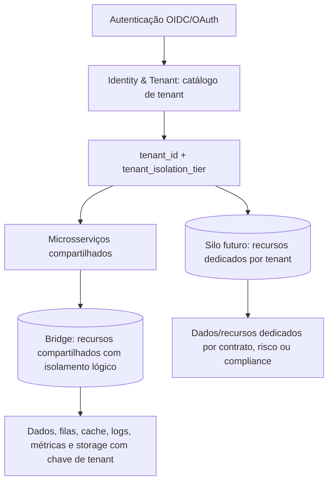

### AD-6 — Autenticação, autorização e contexto confiável [ADOPTED]

- **Binds:** entrada externa, APIs M2M, console humano, gRPC interno, eventos, callbacks, auditoria, tenant context, validação de tokens e autorização local por caso de uso.
- **Prevents:** endpoint público por omissão, modelos próprios de identidade por serviço, tenant spoofing, confused deputy, permissões implícitas em payload, tokens ambíguos, propagação insegura de credenciais e drift de autorização entre bounded contexts.
- **Rule:** segurança usa `deny-by-default`. Todo endpoint exige autenticação, exceto exceções explicitamente públicas. `Identity & Tenant` é dono de tenants, usuários, clientes técnicos, roles, permissions, scopes, claims, chaves e contexto confiável. M2M usa OAuth 2.0 Client Credentials; usuários humanos usam OIDC Authorization Code + PKCE. Serviços validam assinatura, emissor, audiência, sujeito/cliente, expiração, janela temporal, identificador do token, scopes e claims de tenant antes de executar casos de uso sensíveis. Autorização no MVP usa RBAC + scopes + claims de tenant; ABAC e FAPI 2.0 ficam como evolução por risco. Comunicação service-to-service de produção exige identidade de workload verificável, tráfego criptografado, autenticação mútua e autorização local por caso de uso conforme AD-17. Contexto confiável propaga por gRPC metadata e CloudEvents; payload de negócio nunca é fonte de verdade de identidade ou tenant sem validação.

| Superfície | Regra |
| --- | --- |
| API externa M2M | OAuth 2.0 Client Credentials, access token curto, scopes mínimos e tenant resolvido pelo `Identity & Tenant` |
| Usuários humanos | OIDC Authorization Code + PKCE para console, dashboards, evidências e administração |
| Tokens | validação obrigatória de `iss`, `aud`, `sub`/`client_id`, `exp`, `nbf` quando presente, `iat`, `jti`, `scope`, `tenant_id`, assinatura, `kid` e rotação por JWKS |
| Autorização local | cada serviço aplica política do caso de uso com RBAC, scopes e claims; nenhum serviço inventa cadastro próprio de identidade |
| gRPC interno | metadata carrega `tenant_id`, `tenant_isolation_tier`, sujeito/cliente técnico, scopes relevantes, correlation ID, trace ID e request ID; em produção passa pelo mesh conforme AD-17 |
| Eventos | CloudEvents carregam contexto mínimo autorizado por atributos core e extensões válidas: tenant, ator/referência, origem, correlation ID, trace context e versão de schema |
| Ações sensíveis | exigem permissão explícita, auditoria e mascaramento; step-up authentication fica como evolução para operações humanas críticas |
| Falhas | token ausente, expirado, inválido, audiência incorreta, tenant incompatível ou permissão insuficiente resulta em rejeição auditável |

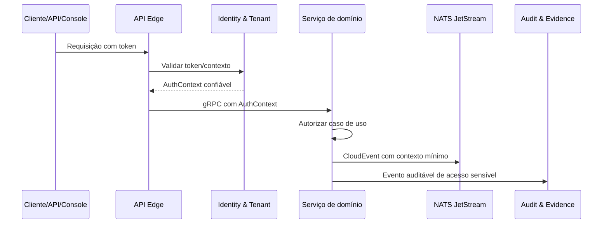

### AD-7 — Observabilidade técnica, de negócio e customer-facing [ADOPTED]

- **Binds:** microsserviços, workers, adapters externos, jobs assíncronos, callbacks, gRPC, eventos, bancos, cache, IA, auditoria, dashboards, alertas, SLOs, retenção e projeções de negócio.
- **Prevents:** serviço sem telemetria, logs não estruturados, tracing quebrado, dashboard de cliente baseado em telemetria bruta, vazamento de dados sensíveis, cardinalidade explosiva, métricas de negócio espalhadas por serviços e incidentes sem correlação com tenant/produto.
- **Rule:** todos os componentes produzem logs estruturados, métricas, traces, health checks, readiness checks, correlation ID e trace ID. OpenTelemetry é o padrão obrigatório de instrumentação e propagação de contexto; OpenTelemetry Collector é o ponto de coleta, redaction, filtragem, batching, retry e roteamento. A stack Grafana OSS é a referência do MVP para operação interna: Prometheus, Loki, Tempo, Grafana e Alertmanager. Observabilidade de negócio pertence ao `Reporting & Insights` por eventos e projeções, não por consulta direta a Prometheus, Loki, Tempo, logs crus ou bancos transacionais. Dashboards customer-facing são curados por tenant e nunca expõem telemetria bruta, infraestrutura, payloads, dados pessoais, segredos, evidências restritas ou detalhes de outros tenants. `tenant_id` em telemetria técnica exige controle explícito de cardinalidade; métricas per-tenant detalhadas ficam preferencialmente em projeções de negócio.

| Camada | Regra |
| --- | --- |
| Instrumentação | OpenTelemetry em API edge, gRPC, workers, eventos, jobs, integrações externas, banco, cache, storage e IA |
| Coleta | OpenTelemetry Collector centraliza redaction, filtros, enrichment, sampling, batching, retry e exportação |
| Métricas técnicas | Prometheus registra séries de baixa/média cardinalidade para SLOs, alertas e operação interna |
| Logs | Loki armazena logs estruturados e mascarados; payloads sensíveis, tokens, segredos e documentos brutos são proibidos |
| Traces | Tempo armazena tracing distribuído com propagação de trace/correlation entre API, gRPC, NATS, jobs e integrações |
| Alertas | Alertmanager dispara alertas por SLO, erro, latência, saturação, DLQ, falha de auditoria, integração crítica, segurança e vazamento potencial |
| Negócio | `Reporting & Insights` calcula funil, volume por tenant, decisões, políticas, custos, IA e integrações por eventos/projeções |
| Cliente | dashboards customer-facing usam apenas projeções curadas, RBAC/scopes, isolamento por tenant, minimização e retenção definida |

| Dashboard interno obrigatório | Foco |
| --- | --- |
| Saúde geral da plataforma | disponibilidade, erro, latência, saturação e versão por serviço |
| API pública e gRPC interno | throughput, p50/p95/p99, deadlines, retries, rate limit, idempotência e erros por operação |
| NATS JetStream e DLQ | backlog, lag, retries, DLQ, idade de mensagens, replay e reprocessamento |
| Integrações externas | timeout, fallback, fornecedor, classe de integração, custo, retry e falhas por tenant/produto quando permitido |
| Segurança e auditoria | autenticação falha, autorização negada, tentativas cross-tenant, replay, falha de evidência e acesso sensível |
| Decisão e negócio | funil, aprovação, recusa, inconclusivos, motivos, políticas, produto, canal, tenant e custo operacional |
| IA/revisão automatizada | uso, latência, erro, fallback, versão de agente/modelo, divergência consultiva e taxa de inconclusivos |
| Deploys | versão, regressão, erro pós-deploy, mudança de latência e impacto por serviço |

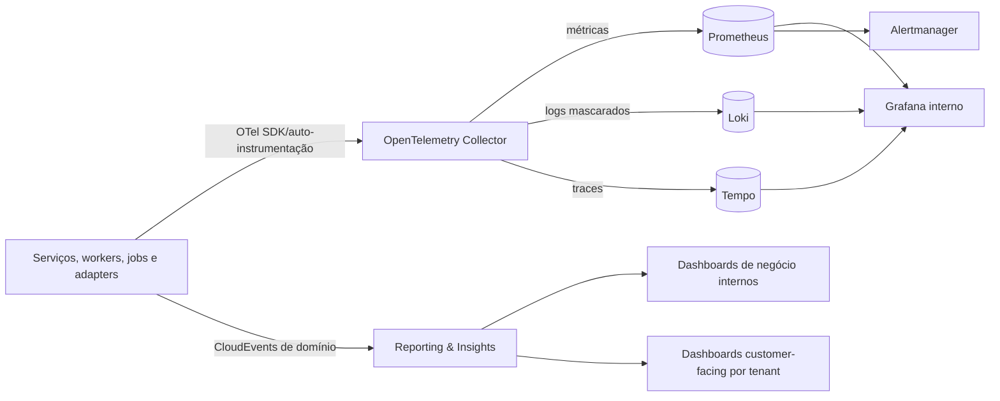

### AD-8 — Auditoria, evidências e imutabilidade verificável [ADOPTED]

- **Binds:** decisões de crédito, ações sensíveis, alterações de política/modelo/agente, acessos a dados sensíveis, exportações, callbacks, evidências decisórias, retenção, restore, chaves, S3 Object Lock e operação do `Audit & Evidence`.
- **Prevents:** uso de logs como auditoria oficial, decisão final sem prova gravada, alteração silenciosa de trilha, deleção administrativa, evidência bruta excessiva, auditoria sem tenant, hash não verificável, exportação não reconciliável e lock-in prematuro em ledger/database especializada.
- **Rule:** `Audit & Evidence` é a trilha oficial de auditoria e evidência; logs operacionais, traces, métricas e eventos de mensageria não substituem essa trilha. O MVP usa banco relacional append-only, com escrita operacional apenas por `INSERT` e sem `UPDATE`/`DELETE` na trilha principal. Eventos críticos carregam `previous_hash` e `current_hash` calculados sobre payload canonicalizado; checkpoints são assinados por lote, tenant ou janela temporal; checkpoints e exportações periódicas vão para Amazon S3 Object Lock conforme AD-19, usando prova minimizada e nunca payload sensível bruto por padrão. Jobs periódicos validam cadeia, checkpoints, exportações e ausência de eventos obrigatórios. Leitura, exportação, tentativa administrativa, falha de escrita e falha de verificação também geram auditoria. Decisão final de crédito não é publicada se auditoria ou evidência crítica falhar; o sistema retorna estado técnico controlado. Ledger/database especializada fica como evolução condicionada a cliente, contrato, auditoria externa ou regulação.

| Elemento | Regra |
| --- | --- |
| Trilha principal | banco relacional append-only do `Audit & Evidence`, isolado dos logs operacionais |
| Permissão de escrita | produtores operacionais têm apenas `INSERT`; manutenção administrativa é segregada, monitorada e auditada |
| Evento mínimo | `event_id`, `tenant_id`, agregado, ação, recurso, ator, origem, resultado, UTC, correlation ID, trace ID e versões aplicáveis |
| Integridade | `previous_hash` + `current_hash` por evento; eventos críticos usam HMAC ou assinatura quando aplicável |
| Checkpoints | digest assinado por lote, tenant ou janela temporal, com chave gerenciada e rotação controlada |
| Exportação imutável | S3 Object Lock conforme AD-19; cópias reconciliáveis com checkpoints e minimização obrigatória |
| Verificação | jobs detectam quebra de cadeia, divergência de checkpoint/exportação, ausência de evento esperado e atraso de exportação |
| Evidências | dados mínimos suficientes; payloads sensíveis brutos são omitidos, referenciados, hasheados, tokenizados ou criptografados |
| Falha crítica | auditoria/evidência crítica ausente bloqueia decisão final e retorna estado como `pending_evidence`, `audit_write_failed` ou equivalente |
| Retenção | prazos e descarte seguem política por classe de dado, tenant, produto, contrato, jurisdição e obrigação regulatória |

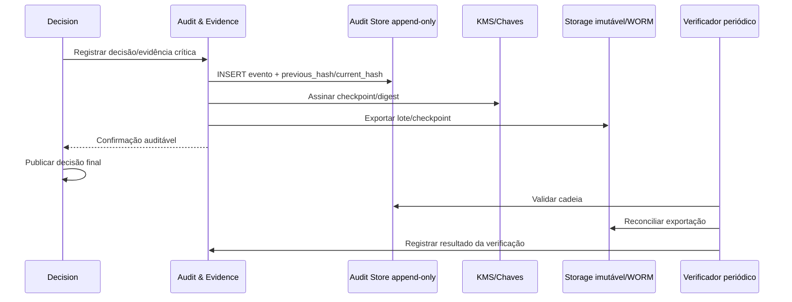

### AD-9 — Privacidade, classificação e ciclo de vida de dados sensíveis [ADOPTED]

- **Binds:** contratos de API, schemas, persistência, eventos, logs, traces, dashboards, evidências, integrações externas, IA, testes, suporte, busca operacional, backups, exportações, retenção, descarte e governança LGPD conforme AD-18.
- **Prevents:** CPF/CNPJ/e-mail como dependência operacional visível, payload sensível bruto persistido por conveniência, hash enumerável de identificador brasileiro, dado completo em logs/traces/eventos, teste com dado real, retenção indefinida, uso secundário sem finalidade e acesso a dado completo sem justificativa auditada.
- **Rule:** proteção de dados é definida por classe de dado e contexto de uso. Todo dado pessoal ou sensível persistido, trafegado ou exposto deve ter `data_class`, finalidade, base legal, owner, papel LGPD, política de retenção, política de descarte e política de exposição antes de produção. Minimização é obrigatória em coleta, persistência, transmissão, logs, traces, eventos, dashboards, respostas e evidências. Payload sensível bruto não é persistido por padrão. Máscara forte é padrão para logs, traces, dashboards, telemetria e respostas operacionais; máscara moderada só é permitida em tela autorizada para reconhecimento visual. Dado completo só pode ser exibido, descriptografado ou usado em busca exata com permissão elevada, justificativa e auditoria. Identificação operacional usa `proposal_id`, `customer_reference`, correlation ID, trace ID ou hash seguro; CPF, CNPJ e e-mail visíveis não podem ser dependência operacional. Hashes de CPF/CNPJ/e-mail devem ser normalizados e protegidos com salt/pepper ou HMAC/chave gerenciada para reduzir risco de enumeração. Dados completos indispensáveis são criptografados, tokenizados ou isolados. Testes usam dados sintéticos.

| Classe/contexto | Regra |
| --- | --- |
| Identificadores diretos | CPF, CNPJ, e-mail, telefone e nome completo são omitidos ou mascarados por padrão |
| Correlação técnica | usa hash seguro normalizado com salt/pepper ou HMAC; hash simples/sem chave é proibido para valores enumeráveis |
| Logs/traces/eventos | não carregam payload sensível bruto, tokens, segredos, documentos, renda detalhada ou identificadores completos |
| Dashboards internos | exibem agregados, buckets, custos, status e tendências; não exibem identificadores diretos completos |
| Dashboards customer-facing | usam projeções curadas por tenant, minimizadas e autorizadas por RBAC/scopes |
| Tela autorizada | máscara moderada só quando houver necessidade legítima de reconhecimento visual |
| Busca por dado original | exige permissão elevada, justificativa, auditoria e não exibe valor completo por padrão |
| Banco transacional | dados completos indispensáveis usam criptografia, tokenização ou isolamento reforçado |
| Evidência decisória | preserva mínimo suficiente para explicabilidade/auditoria, usando referência, hash ou dado criptografado quando possível |
| Integrações externas | snapshots são minimizados; payload externo sensível é transitório salvo exigência explícita |
| IA/modelos | dados para treino/avaliação exigem minimização, anonimização ou pseudonimização e ficam fora do uso operacional bruto por padrão |
| Testes | dados sintéticos são obrigatórios; dumps reais em desenvolvimento são proibidos |

| Item | Retenção baseline |
| --- | --- |
| Logs operacionais mascarados | 90 dias hot, com arquivo conforme contrato |
| Traces técnicos | 15 a 30 dias |
| Métricas técnicas agregadas | 13 meses |
| Proposta canônica minimizada | prazo contratual/regulatório aplicável |
| Evidência decisória minimizada | 5 anos ou prazo maior aplicável |
| Auditoria | 5 anos ou prazo maior aplicável |
| Payload sensível bruto | não persistir por padrão; transitório apenas quando indispensável |
| Dados para IA/modelos | política própria antes de uso, com minimização, anonimização ou pseudonimização |

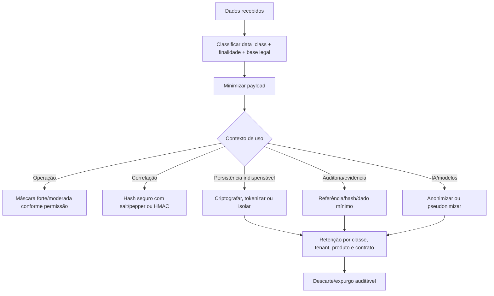

### AD-10 — Integrações externas, adapters e custo operacional [ADOPTED]

- **Binds:** `Integration`, `Decision`, políticas de decisão, adapters externos, webhooks/callbacks, jobs assíncronos, NATS JetStream, custos, retries, DLQ, observabilidade, auditoria, privacidade, homologação e testes de contrato.
- **Prevents:** domínio acoplado a fornecedor, payload proprietário vazando para decisão, consumo inseguro de API externa, paralelismo sem limite, retry perigoso, custo invisível, fornecedor escolhido cedo demais, falha parcial ambígua, webhook sem rastreabilidade e adapter sem sandbox/contrato.
- **Rule:** `Integration` é o único bounded context autorizado a falar com provedores externos de dados, webhooks/callbacks e APIs de terceiros usadas como integração de dados ou notificação. Provedores/modelos de IA pertencem ao `Automated Review`, não ao `Integration`, e seguem AD-11. A arquitetura do MVP define classes de integração e adapters substituíveis, não fornecedores nominais. `Decision` e demais domínios não dependem de payloads, erros, nomes, códigos ou semântica proprietária de fornecedor; cada adapter de provedor implementa anti-corruption layer e publica resultado canônico versionado. Integrações externas críticas executam de forma assíncrona via NATS JetStream com comandos/jobs, fan-out/fan-in, deadlines, timeout, retry seguro, backoff com jitter, idempotência, fallback, DLQ, replay/reprocessamento controlado e resultado parcial explícito. Paralelismo, rate limit e orçamento são controlados por tenant, produto, proposta, classe, adapter, provedor e credencial. Respostas externas são sempre não confiáveis: passam por validação de contrato, normalização, minimização, classificação e mascaramento. Payload sensível bruto não é logado nem persistido por padrão. Custo estimado e real por operação é registrado e projetado para `Reporting & Insights`. Mocks/sandboxes e testes de contrato são obrigatórios para homologação de adapters.

| Responsabilidade | Regra |
| --- | --- |
| Ownership | `Integration` possui adapters, credenciais, jobs, resultados normalizados, custos, tentativas, DLQs e estado de execução |
| Classes MVP | KYC/KYB, bureau/restritivos, antifraude, recebíveis/lastro, Open Finance/fonte autorizada e webhooks/callbacks |
| Contrato de domínio | resultados saem em schema canônico versionado; payload proprietário fica confinado ao adapter |
| Fan-out/fan-in | plano de integração gera jobs paralelos independentes e consolida resultado completo, parcial, faltante ou falho |
| Deadlines | cada job possui timeout; decisões síncronas podem aguardar só até deadline configurado |
| Retry seguro | retries exigem idempotência, backoff com jitter, limite de tentativas e classificação de erro recuperável |
| DLQ/replay | falhas finais vão para DLQ com causa, tenant, classe, adapter e contexto mínimo para reprocessamento controlado |
| Limites | concorrência, rate limit e custo têm teto por tenant, produto, proposta, classe, provedor, adapter e credencial |
| Fallback | política declara integração obrigatória, opcional ou condicional e como tratar resultado parcial |
| Segurança | egress, URLs, redirecionamentos, certificados, autenticação e payloads externos são validados como entrada não confiável |
| Privacidade | payload bruto é transitório; snapshots persistidos são minimizados, referenciados, hasheados, tokenizados ou criptografados |
| Custo | custo estimado e real registra tenant, produto, proposta, classe, adapter, provedor quando existir, chamadas, tentativas e fallback |
| Homologação | todo adapter precisa de mock/sandbox, contrato versionado, testes de contrato, observabilidade e critérios de substituição |

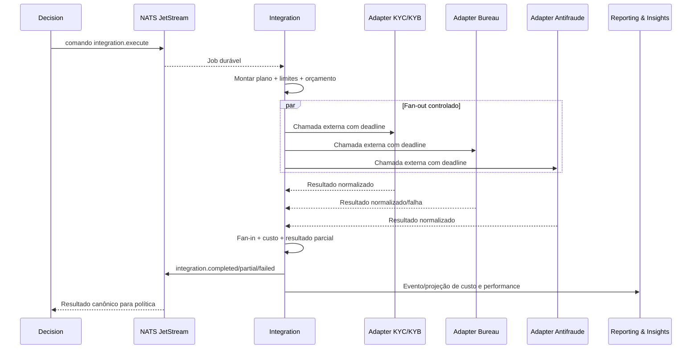

### AD-11 — Revisão automatizada por IA e governança de agentes/modelos [ADOPTED]

- **Binds:** `Automated Review`, `Decision`, políticas de decisão, evidências consultivas, prompts/configurações, adapters de modelo, provedores de IA, guardrails, dados sensíveis, auditoria, observabilidade, custos, testes, fallback e backlog futuro de modelos próprios.
- **Prevents:** IA generativa como decisor final, prompt/payload sensível bruto em evidência, output de IA tratado como verdade, agente com autonomia excessiva, acoplamento a provedor/modelo, drift sem monitoramento, decisão sem política rastreável, revisão consultiva invisível e uso de dados para treino sem governança.
- **Rule:** `Automated Review` é o bounded context separado do MVP para revisão automatizada consultiva por IA e o único autorizado a falar com provedores/modelos de IA. `Decision` continua sendo o único dono da decisão final de crédito por política determinística versionada, regras rastreáveis e códigos de motivo. IA generativa não pode aprovar, reprovar, alterar termos, publicar decisão final ou executar ação externa sem passar por política determinística aprovada. `Automated Review` pode identificar lacunas, inconsistências, sinais relevantes, fatores de explicabilidade e recomendação consultiva tipada. Entradas para IA usam allowlist, minimização, mascaramento e referências; prompt e payload sensível bruto não são persistidos por padrão. Saídas de IA são não confiáveis e passam por schema validation, guardrails, classificação, auditoria e limites de uso antes de virar evidência consultiva. Cada execução registra tenant, proposta, correlation ID, trace ID, versão de agente, versão de prompt/configuração, modelo/provedor quando houver, entradas permitidas, limitações, confiança quando aplicável, custo, latência, fallback e resultado. Prompts/configurações são artefatos versionados e revisáveis. Modelos/provedores são substituíveis por adapter de modelo; credenciais, egress, custos, rate limits e auditoria de provedores/modelos de IA são ownership do `Automated Review`. Treinamento/modelos próprios ficam fora do MVP operacional, exceto backlog governado com datasets minimizados, anonimizados ou pseudonimizados.

| Responsabilidade | Regra |
| --- | --- |
| Ownership | `Automated Review` possui adapters de modelo, credenciais, egress, revisões consultivas, guardrails, versões de agente/modelo/prompt, resultados e custos de IA |
| Decisão final | pertence ao `Decision`; sempre exige política versionada, regras rastreáveis, códigos de motivo e auditoria |
| Autonomia | IA não executa aprovação, reprovação, alteração de termos, callback, integração externa ou mutação de decisão |
| Entrada | usa allowlist de campos, minimização, mascaramento, referências e dados estritamente necessários |
| Prompt/configuração | são artefatos versionados, revisáveis, auditáveis e promovidos por processo controlado |
| Saída | resposta de IA é validada por schema, classificada, limitada e tratada como evidência consultiva |
| Guardrails | bloqueiam prompt injection, vazamento de dado sensível, output fora de schema, tool use indevido e excesso de agência |
| Evidência | registra fatores sugeridos, lacunas, inconsistências, limitações, confiança quando aplicável e versões usadas |
| Observabilidade | mede uso, custo, latência, erro, fallback, versão, divergência consultiva e taxa de inconclusivos |
| Dados para modelos | datasets futuros exigem minimização, anonimização/pseudonimização, segregação por tenant, lineage, viés, explicabilidade e rollback |
| Fallback | falha de IA não vira aprovação/reprovação; política decide entre continuar sem revisão, solicitar dados ou retornar estado controlado |

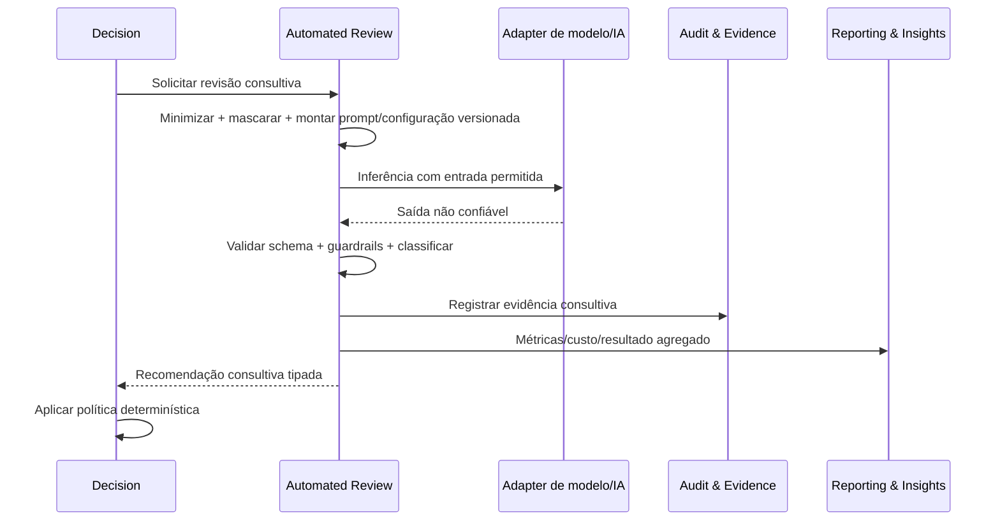

### AD-12 — Infraestrutura AWS/EKS e provisionamento por IaC [ADOPTED]

- **Binds:** produção, ambientes, rede, Kubernetes, workloads backend, bancos, NATS JetStream, storage imutável, secrets, KMS, identidade de workloads, observabilidade, CI/CD de infraestrutura, multi-tenancy `bridge`/`silo`, backups, restore e operação.
- **Prevents:** infraestrutura manual não reprodutível, workloads públicos por acidente, credenciais estáticas em pods, banco autogerenciado sem justificativa, NATS sem persistência/replicação, auditoria sem WORM, ambientes misturados, drift não detectado, tenant `silo` provisionado artesanalmente e mudanças de produção sem revisão.
- **Rule:** a infraestrutura de referência do MVP em produção usa AWS com Amazon EKS para workloads backend em subnets privadas multi-AZ. Entrada pública ocorre somente por componentes de borda/load balancers controlados; comunicação interna permanece privada. PostgreSQL de produção deve ser gerenciado, preferencialmente Amazon RDS/Aurora PostgreSQL, com isolamento lógico por serviço conforme AD-3, criptografia KMS, backup e restore testado. NATS JetStream roda no EKS como cluster de referência de 3 nós, usando StatefulSet/Helm oficial, volumes EBS gp3 criptografados por KMS, anti-affinity, mTLS/autenticação, network policies, exposição interna, observabilidade própria e HA/DR conforme AD-21. Auditoria/exportações imutáveis usam Amazon S3 Object Lock conforme AD-19. Secrets e chaves usam KMS e Secrets Manager ou equivalente; secrets nunca são versionados. Workloads acessam AWS por EKS Pod Identity, com IRSA apenas como fallback justificado, nunca por credenciais estáticas. Ambientes devem ser separados por conta/projeto ou fronteira equivalente. Toda infraestrutura de produção é criada e alterada por IaC com revisão em PR, estado remoto protegido, validação, security scan, plano de mudança e drift detection. GitOps/pipeline, registry, assinatura, SBOM/proveniência e policy enforcement seguem AD-23. Ferramenta IaC, sizing, topologia detalhada e política multi-region ficam para ADRs específicas.

| Componente | Decisão de referência |
| --- | --- |
| Cloud alvo | AWS para o MVP de produção |
| Runtime | Amazon EKS em subnets privadas multi-AZ |
| Entrada pública | ALB/API edge em subnets públicas quando necessário; workloads permanecem privados |
| Tráfego interno | gRPC, NATS, bancos, observabilidade e callbacks internos em rede privada |
| Banco transacional | Amazon RDS/Aurora PostgreSQL, com database/schema/usuário por serviço e criptografia KMS |
| Mensageria | NATS JetStream no EKS conforme AD-21: 3 nós, streams críticos R3, StatefulSet/Helm oficial, EBS gp3 criptografado, anti-affinity, backup/restore e runbooks |
| Auditoria imutável | Amazon S3 Object Lock conforme AD-19 para exportações/checkpoints |
| Secrets/chaves | AWS KMS + AWS Secrets Manager ou equivalente, com rotação e auditoria |
| Identidade de workload | EKS Pod Identity para acesso AWS; IRSA só como fallback justificado; credenciais AWS estáticas em pods são proibidas |
| Rede | security groups, network policies default-deny, egress controlado, endpoints privados quando aplicável |
| Observabilidade | stack AD-7 no EKS ou managed/híbrida, preservando OpenTelemetry como padrão |
| Complementos AWS | SQS/SNS/Lambda/EventBridge só com justificativa específica, sem substituir NATS como backbone |
| IaC | toda mudança de produção via código, PR, plano, validação, scan, estado remoto protegido e drift detection |
| CI/CD e GitOps | GitHub Actions + Argo CD conforme AD-23 |
| Registry e policy | Amazon ECR + Sigstore/Cosign + Kyverno conforme AD-23 |

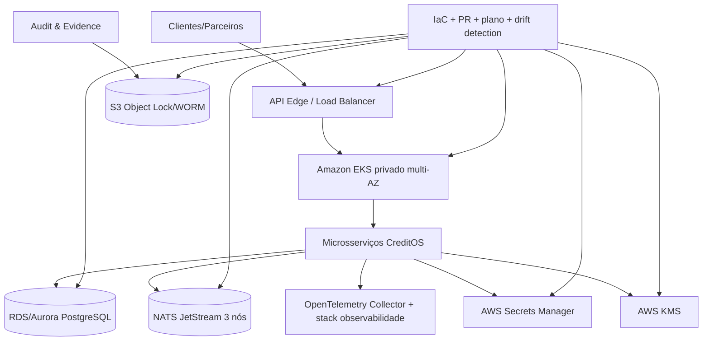

### AD-13 — CI/CD, supply chain e promoção de ambientes [ADOPTED]

- **Binds:** repositório, pull requests, pipelines, builds, imagens, contratos, migrations, IaC, ambientes, deploys, rollback, canary, blue-green, feature flags, supply chain, secrets, observabilidade de release e produção.
- **Prevents:** deploy manual não auditado, rebuild em produção, credencial longa no CI, imagem sem rastreabilidade, mudança de IaC sem plano, drift silencioso, migration cross-service, promoção direta para produção, rollback improvisado e release sem correlação operacional.
- **Rule:** mudanças de aplicação, contratos, schemas, infraestrutura e configuração entram por pull request com checks obrigatórios. CI/CD, GitOps, registry, assinatura, SBOM/proveniência e policy enforcement seguem AD-23. CI valida lint/formatação, testes unitários, integração, contrato, protobuf/AsyncAPI quando aplicável, secrets, dependências, segurança, container e IaC. Contratos são autoridade compartilhada: o produtor versiona e publica, consumidores registram expectativas/testes, e breaking changes exigem versão nova, janela de compatibilidade e plano de migração. Deploys usam artefatos imutáveis por digest e não fazem rebuild no momento da implantação. Ambientes `dev`, `staging`, `prod` e `sandbox` são separados; promoção segue `dev` → `staging` → `prod`, com aprovação explícita para produção, checks verdes e plano de rollback/roll-forward. Estratégias de release seguem AD-22: rolling update é padrão, canary é obrigatório para serviços e mudanças críticas, blue-green é reservado para mudanças de maior risco e feature flags usam OpenFeature. Produção só muda por Argo CD/GitOps ou pipeline protegido, nunca por comando manual. IaC exige plan em PR, estado remoto protegido, apply controlado e drift detection. Acesso AWS do pipeline usa OIDC/identidade federada, sem credenciais long-lived. Imagens ficam no Amazon ECR, são escaneadas, assinadas por Sigstore/Cosign, verificáveis e acompanhadas por SBOM/proveniência quando aplicável. Migrations são owned por serviço, compatíveis com deploy progressivo e não executam transações cross-service. Cada deploy emite evento de release com serviço, versão, commit SHA, digest da imagem, ambiente, versão de migration, operador/pipeline, estratégia de release e correlação para observabilidade.

| Etapa | Gate obrigatório |
| --- | --- |
| Pull request | revisão, lint/formatação, tipagem quando aplicável, testes unitários e secret scan |
| Contratos | validação de OpenAPI, protobuf, AsyncAPI, schemas, compatibilidade e testes de contrato |
| Segurança | dependency scan, SAST quando aplicável, IaC scan, container scan e política de severidade |
| Build | GitHub Actions gera imagem imutável por digest, SBOM, proveniência e assinatura conforme AD-23 |
| Deploy não produtivo | implantação automática ou semiautomática em `dev`/`sandbox`/`staging`, com smoke tests |
| Promoção produção | aprovação, checks verdes, artefato já validado, plano de rollback/roll-forward e janela controlada |
| Estratégia de release | rolling update por padrão; canary e blue-green conforme AD-22 |
| Feature flags | OpenFeature, contexto por tenant, default seguro, owner, expiração, auditoria e plano de remoção |
| Pós-deploy | health/readiness, smoke, SLO watch, evento de release, alertas e correlação com métricas de negócio |
| Policy enforcement | Kyverno bloqueia imagens/manifests fora da política conforme AD-23 |

| Artefato | Regra |
| --- | --- |
| Container image | versionada por tag semântica ou build metadata, implantada por digest, escaneada e assinável |
| Contratos | versionados, publicados como pacote/artefato e bloqueiam breaking change sem plano de migração |
| Migrations | pertencem a um serviço, são backward-compatible e possuem estratégia de roll-forward documentada |
| IaC plan | anexado ou rastreável no PR antes de apply; produção só recebe apply controlado |
| SBOM/proveniência | retidos com o release para rastreabilidade de dependências e origem do build |
| Release record | registrado para auditoria e observabilidade com commit, digest, ambiente e ator/pipeline |

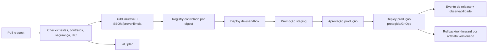

### AD-14 — API pública, callbacks e compatibilidade de contratos [ADOPTED]

- **Binds:** API pública, submissão de propostas, consulta de decisões, callbacks/webhooks, erros, idempotência, versionamento, compatibility windows, OpenAPI, schemas de produto e documentação de integração.
- **Prevents:** payload arbitrário por cliente, enum/status divergente, callback sem retry/idempotência, erro não padronizado, breaking change silencioso, integração B2B frágil e cliente acoplado a detalhe interno.
- **Rule:** API pública usa HTTP/JSON com OpenAPI versionado como contrato externo; gRPC não é exposto publicamente por padrão. Toda operação crítica recebe ou gera correlation ID, request ID e idempotency key quando aplicável. Submissões de proposta aceitam apenas schemas versionados e aprovados para CPF/CNPJ e produtos MVP; extensões por produto são governadas e não viram campo livre sem dono. Respostas usam envelope padronizado de sucesso/erro, códigos de erro estáveis, status de proposta/decisão em enum versionado e sem stack trace/detalhe interno. Callbacks/webhooks usam assinatura, retry controlado, idempotência, correlation ID, payload minimizado e contrato versionado. Breaking changes exigem nova versão, período de compatibilidade, guia de migração e testes de contrato.

| Contrato | Autoridade |
| --- | --- |
| OpenAPI pública | `Proposal Intake` para submissão/consulta inicial; composição com `Decision` por contrato versionado |
| Schema de proposta | `Proposal Intake`, com extensões por produto aprovadas junto a `Decision` e `Integration` quando impactarem decisão ou dados externos |
| Status de proposta | `Proposal Intake` para intake; `Decision` para decisão; projeções apenas espelham |
| Status de decisão | `Decision`, com razão/código de motivo e versão de política |
| Callback/webhook | contrato publicado pelo serviço produtor do evento externo, execução operacional via mecanismo assíncrono conforme AD-4/AD-10 |
| Erros públicos | catálogo comum versionado; serviços não expõem erro interno bruto |

### AD-15 — Governança de políticas, decisão e reason codes [ADOPTED]

- **Binds:** `Decision`, políticas, regras, reason codes, simulação, publicação, versionamento, decisão final, explicabilidade, auditoria, rollback/roll-forward de política e interação com IA consultiva.
- **Prevents:** decisão sem política rastreável, regra alterada retroativamente, reason code inconsistente, IA influenciando resultado fora de política, publicação sem simulação, rollback ambíguo e explicabilidade impossível de reconstruir.
- **Rule:** `Decision` é o único dono de políticas de decisão, versões publicadas, execução determinística, decisão final, termos aprovados e reason codes. Políticas são artefatos versionados, revisáveis, simuláveis, publicáveis e imutáveis após publicação; correção ocorre por nova versão. Toda decisão final registra `policy_id`, `policy_version`, `decision_id`, `proposal_id`, produto, tenant, entradas canônicas permitidas, fatores relevantes, reason codes, termos aprovados/negados/alterados, timestamp e correlation ID. Publicação de política exige validação, simulação/regressão, aprovação autorizada, janela efetiva e plano de rollback/roll-forward. IA consultiva só influencia decisão quando uma política determinística aprovada consumir explicitamente sua evidência validada. Explicabilidade deve ser compreensível para a instituição cliente e suficiente para auditoria/contestação, sem expor dado sensível indevido.

| Estado/artefato | Regra |
| --- | --- |
| Draft de política | pode ser editado, simulado e descartado; não decide produção |
| Política publicada | imutável; possui owner, aprovação, vigência, versão e changelog |
| Simulação/regressão | obrigatória antes de publicação, com dataset minimizado ou sintético quando aplicável |
| Reason codes | catálogo versionado e estável; mudança incompatível exige nova versão |
| Decisão final | sempre aponta para política publicada, entradas canônicas e evidência auditável |
| Rollback/roll-forward | troca versão efetiva futura; decisão passada não é reescrita |

### AD-16 — Stack backend e starter/base do repositório [ADOPTED]

- **Binds:** stack backend, starter/base de microsserviços, layout de monorepo, dependências Python, contratos, testes, tipagem, lint/format, migrations, containers, observabilidade e aplicação prática de DDD/Hexagonal Architecture.
- **Prevents:** stack divergente por serviço, FastAPI virando domínio, SQLAlchemy vazando para entidades, gRPC/NATS acoplados a regras de negócio, starter artesanal por microsserviço, dependências sem lock, tipagem frouxa, testes sem padrão e compartilhamento indevido de domínio entre bounded contexts.
- **Rule:** o backend do MVP usa Python como linguagem padrão, com Python 3.13 como baseline inicial. APIs públicas HTTP/JSON usam FastAPI; DTOs, validação de borda e schemas usam Pydantic v2; chamadas internas síncronas usam `grpcio`/`grpc.aio` + protobuf; persistência usa PostgreSQL via SQLAlchemy 2.x e Alembic 1.x; testes usam pytest e pytest-asyncio; lint/format usa Ruff; tipagem usa Pyright em modo estrito progressivo; instrumentação usa OpenTelemetry Python; dependências e comandos usam `uv` workspace com lock único. Cada microsserviço materializa as decisões AD-1, AD-2 e AD-3 com DDD + Hexagonal Architecture: `domain` não depende de FastAPI, Pydantic de borda, SQLAlchemy, Alembic, gRPC, NATS, Redis, OpenTelemetry, provedores externos ou Kubernetes; `application` coordena casos de uso; `adapters` implementam API, gRPC, eventos, persistência e integrações. Bibliotecas compartilhadas em `packages/` só podem conter contratos, observabilidade, segurança, testes e utilidades técnicas genéricas; entidades, regras, policies e repositories de domínio não são compartilhados entre bounded contexts.

| Área | Decisão |
| --- | --- |
| Runtime | Python 3.13; Python 3.14 somente após compatibilidade de dependências e matriz CI verde |
| API pública | FastAPI com OpenAPI versionado e sem regra de domínio em endpoints/controllers |
| Validação/DTO | Pydantic v2 para contratos de borda; value objects de domínio permanecem no domínio |
| gRPC interno | `grpcio`/`grpc.aio` + protobuf, com contratos versionados e testes de compatibilidade |
| Persistência | SQLAlchemy 2.x em adapters/repositories; Alembic 1.x por serviço para migrations |
| Testes | pytest, pytest-asyncio, testes unitários próximos ao serviço e testes transversais em `tests/` |
| Qualidade | Ruff para lint/format; Pyright strict/progressivo para tipagem |
| Observabilidade | OpenTelemetry Python em adapters/middleware/interceptors, sem dependência no domínio |
| Monorepo | `uv` workspace com `pyproject.toml` raiz, membros por serviço/pacote e `uv.lock` único |
| Containers | uma imagem por serviço implantável, usuário não root, health/readiness e shutdown gracioso |

```text
services/<service>/
  pyproject.toml
  src/creditos_<service>/
    domain/
      entities/
      value_objects/
      services/
      events/
      policies/
    application/
      use_cases/
      ports/
    adapters/
      api/
      grpc/
      events/
      persistence/
      external/
    bootstrap/
  tests/
    unit/
    integration/
    contract/
```

### AD-17 — Service identity, mTLS e autorização service-to-service [ADOPTED]

- **Binds:** gRPC interno, tráfego service-to-service, workloads no EKS, namespaces, service accounts, autorização de malha, identidade para acesso AWS, network policies, observabilidade de segurança e exceções operacionais.
- **Prevents:** confiança implícita na rede privada, TLS manual divergente por serviço, chamada gRPC autorizada só por token de aplicação, credenciais AWS estáticas em pods, política allow-all entre namespaces, adoção de AWS App Mesh em fim de suporte, e acoplamento indevido entre identidade de serviço e permissão IAM.
- **Rule:** produção usa Istio Ambient Mesh como baseline de service mesh no EKS. Workloads de microsserviços entram no mesh por namespace ou label explícita, e tráfego interno serviço→serviço deve usar mTLS automático do mesh em postura STRICT/equivalente. Namespaces começam com postura default-deny para tráfego entre workloads; chamadas são liberadas por `AuthorizationPolicy` usando identidade de workload, namespace, service account, porta e, quando houver waypoint/L7, método/path aplicável. gRPC interno entre microsserviços passa pelo mesh em produção; exceções para health checks, readiness, métricas, NATS, banco, DNS, control plane e componentes de infraestrutura precisam ser explícitas, mínimas e auditáveis. EKS Pod Identity é o padrão para permissões IAM de pods que acessam AWS; IRSA só é permitido como fallback justificado. TLS manual na aplicação, SPIFFE/SPIRE puro, Linkerd ou Cilium mTLS só substituem essa decisão por ADR posterior. AWS App Mesh não é adotado por descontinuação oficial de suporte em 2026-09-30.

| Superfície | Regra |
| --- | --- |
| Service mesh | Istio Ambient Mesh em produção para workloads de domínio no EKS |
| mTLS interno | obrigatório entre workloads no mesh em postura STRICT/equivalente; tráfego plaintext service-to-service é exceção documentada |
| Autorização de malha | `AuthorizationPolicy` libera origem/destino por workload identity, namespace, service account, porta e método/path quando houver waypoint/L7 |
| Namespaces | default-deny para entrada entre workloads; labels de entrada no mesh são controladas por IaC/GitOps |
| gRPC interno | permitido somente entre identidades autorizadas e com deadlines/metadata conforme AD-4 e AD-6 |
| Acesso AWS | EKS Pod Identity associa IAM role a service account; menor privilégio por serviço |
| IRSA | permitido somente por limitação de EKS Pod Identity, legado ou integração específica documentada |
| NetworkPolicy | continua obrigatória; mesh não substitui segmentação de rede |
| Observabilidade | métricas/logs/traces de segurança do mesh entram na stack AD-7 sem payload sensível |
| AWS App Mesh | proibido como nova dependência por fim de suporte oficial em 2026-09-30 |

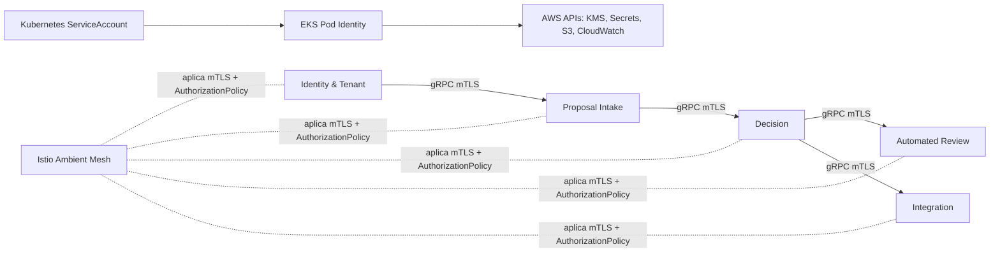

### AD-18 — LGPD operacional e governança de privacidade [ADOPTED]

- **Binds:** papéis LGPD, contratos B2B, tenants, dados pessoais, bases legais, consentimentos, direitos dos titulares, RIPD, incidentes, fornecedores externos, IA/modelos, retenção, descarte, auditoria, suporte e evidências.
- **Prevents:** CreditOS assumindo papel jurídico ambíguo, consentimento tratado como base universal, dados sem finalidade/base legal, solicitação de titular impossível de atender, incidente sem owner, suboperador sem governança, uso secundário de dados pessoais para IA/modelos e tratamento de alto risco sem avaliação prévia.
- **Rule:** a governança LGPD do MVP usa modelo híbrido por finalidade. A instituição cliente/tenant é a controladora dos dados e da decisão de crédito perante o titular. CreditOS atua como operador para tratamentos de análise de crédito/risco executados em nome do tenant. CreditOS é controlador independente apenas para dados próprios de operação SaaS, segurança, billing, usuários administrativos, auditoria técnica e melhoria da plataforma sem dados identificáveis. Fornecedores externos são suboperadores quando processam dados pessoais em nome do tenant via CreditOS. Cada dado pessoal deve carregar ou referenciar `controller_role`, `processor_role`, finalidade, base legal, owner, retenção, descarte, política de exposição e origem da instrução. Direitos dos titulares são atendidos primariamente pelo tenant; CreditOS fornece APIs, evidências e rotinas para localizar, exportar, corrigir, bloquear, anonimizar ou eliminar dados conforme instrução válida do controlador e limites legais/de retenção. Crédito, perfil, decisão automatizada, antifraude e dados financeiros são tratados como alto risco e exigem RIPD antes de produção. Incidentes com dados pessoais geram registro interno, classificação de risco, evidências, timeline, contenção e comunicação rápida ao tenant; comunicação à ANPD/titular cabe ao controlador, com suporte operacional do CreditOS. Modelos próprios/IA com dados pessoais são proibidos sem nova base legal, finalidade compatível, RIPD, minimização e aprovação formal. Dados de crianças/adolescentes ficam fora do MVP, salvo ADR e validação jurídica.

| Tema | Regra |
| --- | --- |
| Controlador principal | tenant/instituição cliente para dados do solicitante, proposta, decisão de crédito e relacionamento com titular |
| Operador | CreditOS processa dados em nome do tenant para análise, decisão, integrações, auditoria e reporting contratado |
| Controlador independente | CreditOS somente para operação SaaS própria, segurança, billing, usuários administrativos e melhoria sem identificadores |
| Suboperadores | provedores externos, IA/modelos e infraestrutura que processem dados pessoais exigem cadastro, finalidade, contrato e avaliação |
| Bases legais candidatas | proteção do crédito, execução de contrato/procedimentos preliminares, obrigação legal/regulatória, exercício regular de direitos, consentimento específico ou legítimo interesse documentado |
| Consentimento | não é base universal; quando usado, exige finalidade específica, referência rastreável e revogação/tratamento posterior governados |
| Direitos dos titulares | confirmação, acesso, correção, anonimização, bloqueio, eliminação, portabilidade, informação e revisão/contestação são suportados por APIs/evidências para o tenant |
| Decisão automatizada | `Decision` preserva política, versão, reason codes, fatores relevantes e evidências para explicação e revisão pelo controlador |
| RIPD | obrigatório antes de produção para fluxos de alto risco: crédito, perfil, antifraude, decisão automatizada, Open Finance e IA com dado pessoal |
| Incidentes | classificação, contenção, timeline, evidências, impacto por tenant/titular e notificação ao tenant dentro de SLA contratual |
| Crianças/adolescentes | fora do MVP; payload deve rejeitar ou bloquear fluxo até ADR e validação jurídica |

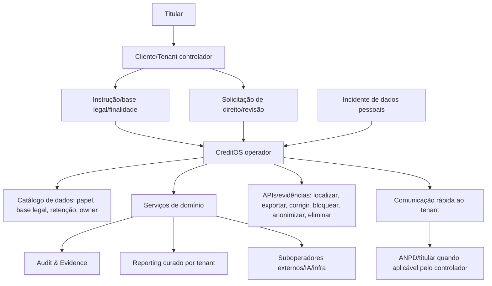

### AD-19 — S3 Object Lock/WORM, retenção e descarte [ADOPTED]

- **Binds:** `Audit & Evidence`, checkpoints, exportações imutáveis, evidências decisórias, retenção, legal hold, restore, replicação, KMS, descarte LGPD, incidentes, auditoria externa e operação de buckets S3.
- **Prevents:** WORM como depósito eterno de payload sensível bruto, Compliance mode aplicado por conveniência, impossibilidade operacional de atender descarte quando permitido, bypass invisível de Governance mode, legal hold sem owner, replicação sem retenção equivalente, objeto ilegível por perda de chave KMS e auditoria sem prova reconciliável.
- **Rule:** Amazon S3 Object Lock é o WORM de referência para exportações/checkpoints de auditoria. Buckets WORM têm versioning obrigatório e Object Lock habilitado desde a criação por IaC. Compliance mode é reservado para hashes, digests, checkpoints assinados e pacotes mínimos de evidência que exigem retenção indeletável validada por contrato, regulação ou jurídico. Governance mode é o padrão para evidências operacionais protegidas que possam exigir descarte excepcional por instrução válida do controlador; bypass exige permissão segregada `s3:BypassGovernanceRetention`, justificativa, aprovação, break-glass e auditoria. Legal Hold é usado apenas para disputa, auditoria, investigação ou obrigação específica, sem prazo fixo, com owner e remoção explícita autorizada. Payload sensível bruto não vai para WORM por padrão; WORM guarda prova minimizada, referência, hash/digest, versão, timestamp, razão, política e integridade. Dados pessoais completos permanecem em storage governável, criptografado, tokenizado ou isolado. Pedidos de eliminação geram bloqueio de exposição, tombstone/restrição e expurgo quando a retenção aplicável permitir. Replicação WORM só ocorre para bucket destino também com Object Lock habilitado e retenção/metadados compatíveis. Chaves KMS de objetos WORM não podem ser destruídas antes do maior prazo de retenção aplicável.

| Classe | Modo |
| --- | --- |
| Hash/digest/checkpoint assinado | Compliance mode quando retenção indeletável for exigida e validada |
| Pacote mínimo de evidência regulatória/contratual | Compliance mode somente com minimização e retenção definida |
| Evidência operacional com dados pessoais mínimos | Governance mode com bypass segregado e auditado |
| Payload sensível bruto | proibido em WORM por padrão |
| Disputa/investigação/auditoria externa | Legal Hold com owner, razão, escopo e remoção controlada |
| Pedido de eliminação LGPD | bloquear exposição/tombstone; expurgar após retenção; não encurtar Compliance mode |
| Replicação | destino com Object Lock, versioning e metadados de retenção compatíveis |
| KMS | chaves preservadas e rotacionadas sem destruição antes da retenção |

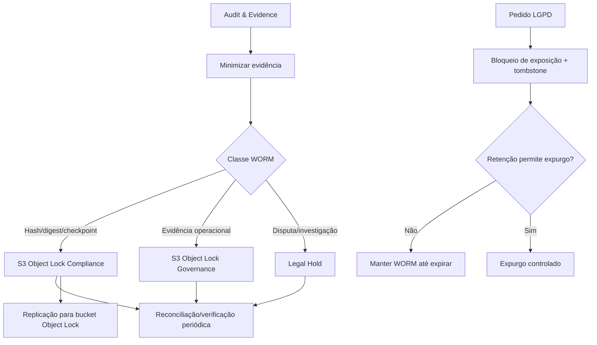

### AD-20 — Estratégia detalhada `bridge`/`silo` por recurso e migração de tenant [ADOPTED]

- **Binds:** catálogo de tenants, `tenant_isolation_tier`, roteamento de isolamento, bancos, schemas, usuários de banco, NATS accounts/subjects/streams/consumers, cache, storage, buckets, object keys, secrets, KMS, reporting, auditoria, integrações, IaC, onboarding, migração e operação multi-tenant.
- **Prevents:** `pooled` puro para dados sensíveis de crédito/risco, `silo` total prematuro no MVP, isolamento diferente por serviço sem catálogo central, migração artesanal de tenant, subjects globais sem tenant, credenciais compartilhadas entre tenants, custos invisíveis por tenant e vazamento cross-tenant por cache, storage ou dashboard.
- **Rule:** CreditOS usa `bridge` detalhado no MVP: infraestrutura compartilhada, mas isolamento forte por tenant em dados, mensagens, storage, secrets, reporting, auditoria e integrações. `Pooled` puro é proibido para dados transacionais sensíveis de crédito/risco. `Silo` total não é o padrão do MVP; evolução para `silo` ocorre por recurso ou serviço quando risco, volume, contrato, região, performance, custo ou compliance exigirem. `Identity & Tenant` mantém o catálogo central de tenants, `tenant_isolation_tier`, critérios de roteamento, recursos alocados, estado de migração e trilha de mudanças. Qualquer recurso dedicado para tenant deve ser criado por IaC, registrado no catálogo e observável por custo, saúde e capacidade. O caminho `bridge → silo` exige snapshot/export por serviço, replay de eventos quando aplicável, reconciliação, validação, cutover no catálogo, rollback/roll-forward e auditoria.

| Recurso | Bridge no MVP | Evolução para silo |
| --- | --- | --- |
| Compute/API | pods e deployments compartilhados por serviço, com autorização e rate limit por tenant | namespace, node pool ou deployment dedicado quando contrato, noisy neighbor ou compliance exigirem |
| Banco transacional | cluster físico compartilhado; database/schema/usuário por serviço; tenant em chave/índice/política de acesso | database/schema/cluster dedicado por serviço e tenant, com migração auditada |
| NATS JetStream | cluster compartilhado; subjects tenant-aware; permissões por serviço e classe de evento | NATS Account, streams, consumers ou cluster dedicado para tenant/tier de maior isolamento |
| Cache | chave com tenant/contexto, TTL e proibição de entradas cross-tenant | instância, database lógico ou namespace dedicado quando risco/performance exigirem |
| Storage/S3 | prefixo/bucket por tenant, tier ou classe; object keys sempre tenant-aware | bucket dedicado, policy dedicada e Object Lock dedicado quando aplicável |
| Secrets/KMS | secret por tenant/provedor/serviço; chaves compartilhadas apenas quando política permitir | secret e CMK dedicados por tenant/tier/contrato |
| Reporting | projeções e dashboards customer-facing filtrados por tenant e autorização | read model dedicado para tenant de alto volume, contrato ou performance |
| Auditoria | trilha append-only com tenant obrigatório e exportações WORM segmentadas por classe | store/export/bucket dedicado quando contrato, auditoria externa ou regulação exigirem |
| Integrações | credenciais, limites, custos, retries e DLQ segregados por tenant/provedor | adapter, credencial, fila/stream ou capacidade dedicada por tenant |
| Onboarding/migração | catálogo registra tier, recursos, quotas e limites | workflow IaC + migração + reconciliação + cutover auditado |

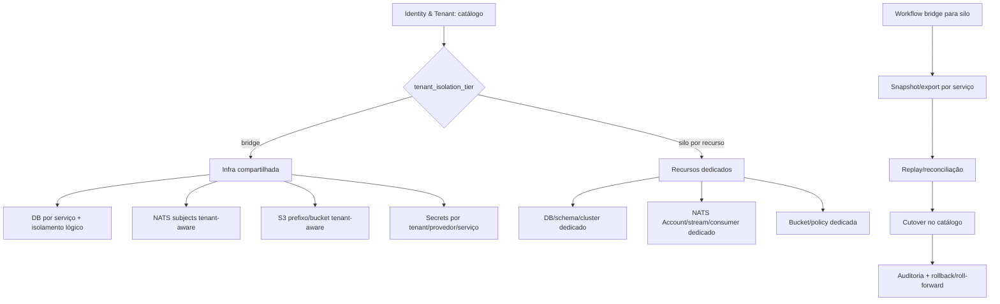

### AD-21 — HA/DR do NATS JetStream, backups e operação [ADOPTED]

- **Binds:** NATS JetStream, streams, consumers, DLQs, comandos assíncronos, eventos de domínio, callbacks, integrações externas, reporting, auditoria operacional de mensageria, EKS, EBS, KMS, observabilidade, backup, restore, DR, runbooks, sizing e operação.
- **Prevents:** stream crítico R1 em produção, perda silenciosa de mensagens por nó único, dependência de NAS/NFS/shared filesystem, cluster sem quorum claro, restore nunca testado, DR multi-região tratado como sincronização perfeita, DLQ sem retenção, replay sem controle e operação sem métricas de liderança/replicação.
- **Rule:** NATS JetStream roda em cluster mínimo de 3 nós no MVP, distribuído em 3 AZs quando disponível. Streams críticos usam `file` storage e `Replicas: 3`; `Replicas: 1` é proibido para fluxos críticos de crédito, decisão, auditoria, integrações externas críticas, callbacks, DLQ e comandos que exigem replay. Volumes usam EBS `gp3` criptografado por KMS, com storage próprio por pod; NAS, NFS, volume compartilhado ou Multi-Attach são proibidos para JetStream. Placement, labels/tags e anti-affinity espalham réplicas por AZ. Um stream R3 exige quorum de 2 réplicas saudáveis para aceitar escrita. Backups periódicos por stream/account são obrigatórios, com verificação de integridade, restore drill, retenção definida e runbook. Falha permanente de peer usa peer-remove/rebalance conforme runbook. Perda de quorum exige restauração a partir de snapshot validado. DR multi-região fica como evolução por source/mirror streams assíncronos seletivos e não promete sincronização perfeita nem RPO zero. Streams de evidência, decisão e DLQ têm retenção maior que comandos transitórios.

| Tema | Regra |
| --- | --- |
| Cluster MVP | 3 nós JetStream no EKS, preferencialmente um por AZ |
| Streams críticos | `Replicas: 3`, `file` storage, retenção explícita e DLQ/replay controlados |
| Streams não críticos | R1 só permitido para dados transitórios, reconstituíveis e sem impacto em decisão/auditoria |
| Quorum | R3 precisa de 2 réplicas saudáveis; sem líder/quorum, escrita crítica deve falhar de forma controlada |
| Storage | EBS `gp3` por pod, criptografado por KMS; NAS/NFS/shared filesystem proibidos |
| Placement | anti-affinity, labels/tags e distribuição por AZ para reduzir falha correlacionada |
| Backup | `nats stream backup`/`nats account backup` ou automação equivalente, com integridade checada |
| Restore | restore drill periódico, RTO/RPO medidos e runbook versionado |
| Peer failure | usar peer-remove/rebalance somente por runbook e auditoria operacional |
| DR multi-região | source/mirror assíncrono seletivo como evolução; não é RPO zero |
| Observabilidade | leader, replicas current, lag, ack, redeliveries, DLQ, storage, quorum, failed peers, backup age e restore drill |

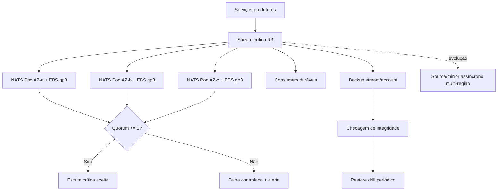

### AD-22 — SLO/SLI, DR global, estratégia de release e feature flags [ADOPTED]

- **Binds:** SLOs internos, SLIs, error budget, alertas, dashboards, incidentes, DR global, RTO/RPO, multi-AZ, multi-região, release, rollback, canary, blue-green, feature flags, OpenFeature, observabilidade e comunicação customer-facing.
- **Prevents:** SLA público sem histórico operacional, SLO de 100%, métrica fácil em vez de métrica percebida pelo cliente, multi-região active-active prematuro, DR sem RTO/RPO, rollback improvisado, canary opcional em mudança crítica, feature flag sem owner/expiração e flag vendor-specific espalhada no domínio.
- **Rule:** o MVP define SLOs internos para guiar operação e priorização, mas não publica SLA contratual até existir histórico operacional, contrato e validação jurídica. Produção inicial é single-region multi-AZ, preparada para evolução multi-região futura; active-active multi-região não é adotado no MVP. DR regional inicial usa recuperação manual ou semi-automatizada, com `RTO` de 4 horas e `RPO` de 15 minutos para dados críticos restauráveis por backup, snapshot ou eventos. DR multi-região evolui para warm standby ou pilot light quando contrato, volume, região, compliance ou histórico operacional justificarem. Rolling update é o padrão de deploy; canary é obrigatório para APIs públicas, `Decision`, `Integration`, `Automated Review` e mudanças de contrato; blue-green é reservado para schema incompatível, infraestrutura crítica, runtime/base image ou migração complexa. Feature flags usam OpenFeature como abstração vendor-neutral, são tenant-aware, auditáveis, têm owner, motivo, expiração, default seguro, plano de remoção e não podem substituir autorização, contrato ou decisão determinística versionada.

| Jornada/Capacidade | SLI | SLO interno MVP |
| --- | --- | --- |
| API pública | disponibilidade mensal de requisições válidas | 99.9% interno, sem SLA público inicial |
| Submissão de proposta | latência para aceitar, validar e enfileirar | `p95 <= 500 ms`, sem esperar integrações externas |
| Decisão assíncrona | tempo até decisão final ou inconclusiva | `p95 <= 60 s` quando provedores externos respondem dentro dos timeouts |
| Escrita de auditoria crítica | latência de persistência/evidência | `p99 <= 300 ms` ou falha controlada sem publicar decisão final |
| Callback/webhook | entrega eventual com retry/DLQ | medido por tenant/tipo, com DLQ e reprocessamento controlado |
| Reporting | freshness das projeções operacionais/customer-facing | `p95 <= 5 min` para dados não transacionais |
| IA consultiva | latência, erro, fallback, custo e divergência | medido por tenant/produto/modelo antes de SLA |

| Tema | Regra |
| --- | --- |
| SLA externo | não publicado no MVP sem histórico operacional e contrato |
| Error budget | SLOs internos governam risco de release e prioridade operacional |
| Falha pod/nó/AZ | recuperação automática via Kubernetes/EKS, RDS/Aurora e NATS conforme AD-12/AD-21 |
| Falha regional | recuperação manual/semi-automatizada inicial, com runbook e restore drills |
| Multi-região | warm standby/pilot light como evolução; active-active fora do MVP |
| Rolling update | padrão para mudanças compatíveis e baixo risco |
| Canary | obrigatório para serviços públicos, `Decision`, `Integration`, `Automated Review` e contratos |
| Blue-green | reservado para mudanças de alto risco ou cutover controlado |
| Feature flags | OpenFeature, contexto por tenant, owner, expiração, default seguro, auditoria e remoção |

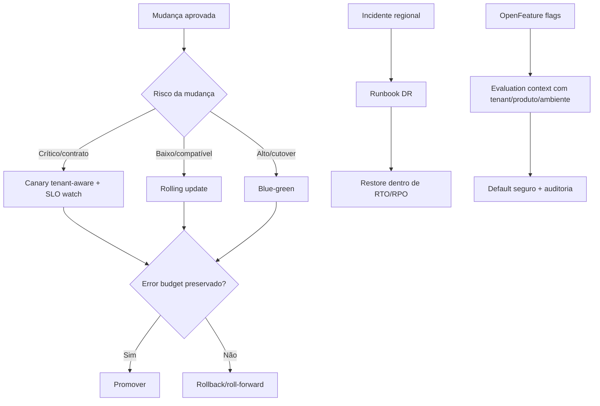

### AD-23 — CI/CD, GitOps, registry, assinatura e policy enforcement [ADOPTED]

- **Binds:** repositório GitHub, pull requests, GitHub Actions, AWS OIDC, builds, testes, contratos, imagens OCI, Amazon ECR, SBOM, proveniência, Sigstore/Cosign, GitHub Artifact Attestations, Argo CD, manifests/charts, EKS, Kyverno, admission policies, SLSA, ambientes, deploys, exceções, auditoria de release e operação de supply chain.
- **Prevents:** credenciais long-lived no CI, deploy direto/manual em produção, imagem sem digest, registry não aprovado, artefato sem origem verificável, assinatura opcional, SBOM/proveniência ignorados, admission sem enforcement, exceção permanente invisível, GitOps divergente do cluster, policy engine escolhido por preferência local e busca prematura por SLSA L3 antes do fluxo estabilizar.
- **Rule:** GitHub Actions é o CI oficial do MVP e autentica na AWS via OIDC, sem secrets AWS long-lived. Amazon ECR é o registry privado para imagens OCI e artefatos relacionados. Builds de release geram imagem por digest, SBOM, proveniência, assinatura keyless Sigstore/Cosign e GitHub Artifact Attestations quando aplicável. O alvo inicial é SLSA Build L2; evolução para Build L3 ocorre por reusable workflows, hardening de runners/builders e verificação de proveniência quando a esteira estabilizar. Produção não recebe `kubectl apply`, Helm manual ou apply direto do CI. O CI publica artefatos, atualiza manifests/charts no repositório GitOps e o Argo CD reconcilia o estado desejado no EKS. Kyverno é o admission policy inicial e bloqueia imagens sem digest fixo, fora do ECR aprovado, sem assinatura/proveniência exigida, sem SBOM quando obrigatório, pods sem requests/limits, manifests fora das políticas de namespace/mesh/security e bypass não autorizado. Exceções são temporárias, auditadas, com owner, motivo, escopo, expiração e aprovação explícita.

| Camada | Decisão |
| --- | --- |
| CI | GitHub Actions com workflows versionados, reusable workflows para controles comuns e OIDC para AWS |
| Registry | Amazon ECR privado por ambiente/conta/região, com scanning, lifecycle, replicação quando necessária e OCI artifacts |
| Assinatura | Sigstore/Cosign keyless por identidade OIDC; fallback com KMS só por ADR posterior |
| Proveniência/SBOM | GitHub Artifact Attestations e SBOM SPDX ou CycloneDX nos artefatos de release |
| GitOps | Argo CD reconcilia manifests/charts no EKS; CI não aplica produção diretamente |
| Policy enforcement | Kyverno em modo enforce para políticas críticas e audit para novas políticas antes de promoção |
| SLSA | Build L2 inicial; Build L3 como evolução por reusable workflows, isolamento/hardening e verificação |
| Exceções | temporárias, auditadas, com owner, justificativa, escopo e expiração |

| Gate | Regra |
| --- | --- |
| PR | revisão obrigatória, checks verdes, branch protection e CODEOWNERS para áreas críticas |
| Build | imagem por digest, SBOM, proveniência, assinatura e scan antes de promoção |
| Contratos | OpenAPI, protobuf, AsyncAPI e schemas bloqueiam breaking change sem versão/migração |
| IaC/manifests | plan/diff, scan, validação de policy e revisão antes de merge |
| Deploy staging | Argo CD sync, smoke, health, SLO watch e evento de release |
| Deploy prod | aprovação protegida, GitOps, canary/blue-green quando aplicável e rollback/roll-forward |
| Admission | Kyverno nega violação crítica e registra/audita exceções |

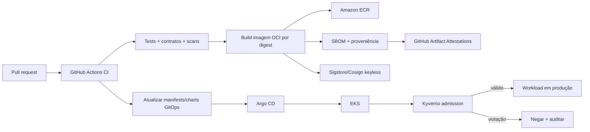

### AD-24 — Gate jurídico/contratual pré-produção e responsabilidades LGPD [ADOPTED]

- **Binds:** AD-18, AD-19, AD-22, contratos B2B, DPA, papéis LGPD, matriz RACI, catálogo jurídico de dados, bases legais, retenção, descarte, suboperadores, RIPD, incidentes, SLAs LGPD, comunicação ao tenant/controlador, textos de comunicação, onboarding de cliente real e release de produção.
- **Prevents:** arquitetura fingindo ser parecer jurídico, produção com cliente real sem DPA validado, papel controlador/operador ambíguo, suboperador sem contrato/finalidade, RIPD esquecido para tratamento de alto risco, SLA público sem validação, comunicação de incidente sem responsável, retenção/descarte contratualmente inconsistente e validação jurídica perdida no fim do projeto.
- **Rule:** validação jurídica/contratual final é gate externo obrigatório antes de produção com cliente real ou onboarding de tenant que processe dados pessoais de solicitantes. AD-18, AD-19 e AD-22 ficam arquiteturalmente aprovados, mas sua aplicação em produção depende de validação formal de DPA/contrato, papéis LGPD, matriz RACI, catálogo jurídico de dados, bases legais, retenção/descarte, suboperadores, RIPD, incidentes, SLAs LGPD, comunicação ao tenant/controlador e textos de comunicação. CreditOS deve notificar o tenant/controlador sem demora injustificada em incidentes relevantes; o SLA contratual interno sugerido é até 24h após confirmação/classificação inicial, sujeito à validação jurídica. Comunicação à ANPD/titular é responsabilidade primária do controlador/tenant, com suporte operacional do CreditOS. O projeto deve manter uma tarefa final obrigatória com checklist e instruções de execução em `handoffs/legal-contractual-validation-final-task.md`.

| Item | Regra |
| --- | --- |
| Natureza do gate | externo, jurídico/contratual e pré-produção; não substitui parecer jurídico |
| Bloqueio | cliente real/onboarding produtivo bloqueado até aprovação formal |
| DPA/contrato | valida papéis, instruções do controlador, responsabilidades, auditoria, segurança, retenção e descarte |
| Matriz RACI | cobre incidente, titular, revisão de decisão automatizada, retenção/descarte, suboperadores e auditoria |
| Catálogo jurídico | finalidade, base legal, classe, owner, retenção, descarte, exposição e suboperadores por fluxo |
| RIPD | exigido antes de produção para crédito, perfil, antifraude, decisão automatizada, Open Finance e IA com dado pessoal |
| Incidentes | CreditOS registra/classifica e notifica tenant/controlador; controlador comunica ANPD/titular quando aplicável |
| SLA externo | não publicado no MVP sem histórico operacional, jurídico e aprovação comercial |
| Tarefa final | checklist obrigatório em `handoffs/legal-contractual-validation-final-task.md` |

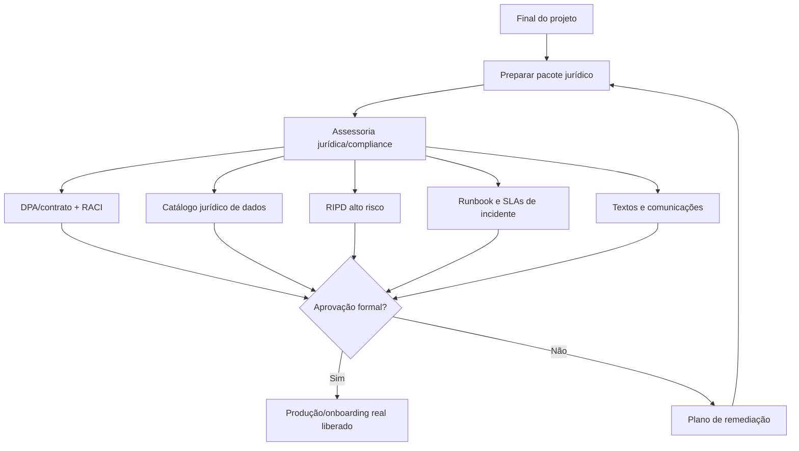

## Structural Seed

```text
creditos/
  pyproject.toml
  uv.lock
  services/
    identity-tenant/
    proposal-intake/
    decision/
    automated-review/
    integration/
    audit-evidence/
    reporting-insights/
  packages/
    contracts/
    observability/
    security/
    testing/
  tests/
    integration/
    contract/
    e2e/
    performance/
    security/
  infra/
    iac/
    kubernetes/
  docs/
    architecture/
    standards/
    adr/
    runbooks/
    api/
  scripts/
```

## Project-End Required Tasks

- Executar a validação jurídica/contratual final antes de produção com cliente real, usando `handoffs/legal-contractual-validation-final-task.md` como checklist obrigatório.

## Deferred

- Sizing final AWS/EKS, capacidade inicial, autoscaling, quotas, limites de custo e política multi-region/DR.
- Detalhe físico de migrations, naming de schemas/databases e política de migração por serviço.
- Versões exatas/pins de dependências Python no `pyproject.toml`/`uv.lock`, matriz de upgrade e política de Renovate/Dependabot.
- Parâmetros finais de buckets S3 Object Lock, contas, regiões, retenção por classe, replication rules, Inventory/Storage Lens, restore drills e runbooks.
- Estratégia final de ambientes ephemeral/preview.
- Política final de migrations, rollback/roll-forward e compatibilidade de contratos.
- Convenção final de pacotes, namespaces e estrutura de código.
- Catálogo completo de subjects, streams, consumers, DLQs e contratos AsyncAPI.
- Parâmetros finais de namespaces, contas, bancos, buckets, streams, quotas e custos para tenants em modelo `silo`.
- Provedor de identidade, modelo de federation, lifecycle de clientes técnicos e política exata de rotação de chaves.
- Topologia operacional final do Istio Ambient Mesh, políticas de entrada por namespace, waypoints quando necessários, upgrade, exceções e runbooks.
- Critérios formais para FAPI 2.0, `private_key_jwt`, mTLS, DPoP, ABAC e step-up authentication.
- Modo operacional da stack de observabilidade: self-hosted, managed ou híbrido.
- Política exata de retenção, sampling, cardinalidade, exemplars e custos por ambiente/tenant.
- Catálogo final de métricas, labels permitidos, severidades, rotas de alerta e runbooks.
- Schema final de auditoria/evidência, canonicalização do payload, algoritmo de hash e formato de assinatura.
- KMS/chaves, rotação, segregação de funções e procedimento de recuperação para checkpoints assinados.
- Nomes finais dos estados técnicos para falha de auditoria/evidência crítica no contrato de API.
- Periodicidade de checkpoints/exportações e runbooks de divergência.
- Catálogo final de classificação de dados, campos sensíveis, finalidades, bases legais, papéis LGPD, owners, retenção e descarte.
- Estratégia física de tokenização, criptografia de campo, vault, KMS, envelope encryption e rotação de salt/pepper.
- Regras finais de anonimização/pseudonimização para datasets de IA, validação de risco de reidentificação e segregação por tenant.
- Processo de expurgo, retenção legal, exceções contratuais, backup restore e prova de descarte.
- Catálogo final de classes de integração, adapters MVP, schemas canônicos e contratos de erro/resultado parcial.
- Tabela de custo estimado/real, unidade de cobrança, orçamento, teto por tenant/produto e projeções financeiras.
- Políticas exatas de timeout, retry, backoff, jitter, circuit breaker, bulkhead, DLQ, replay e reprocessamento por classe.
- Modelo de credenciais externas, secrets, rotação, egress allowlist, validação de URL e proteção contra SSRF.
- Processo de homologação, sandbox, mocks, testes de contrato, substituição e desativação de fornecedores.
- Provedor/modelo de IA, modo de execução, custo, residência de dados e estratégia de fallback por tenant/produto.
- Catálogo de prompts/configurações, processo de revisão, promoção, rollback e testes de regressão de agentes.
- Contrato final de evidência consultiva, métricas de qualidade, avaliação de viés, drift e divergência com decisão final.
- Política de retenção de prompts, respostas, embeddings se existirem, datasets de avaliação e dados usados em inferência.
- Arquitetura futura de `Data & Model Governance` para treinamento/avaliação de modelos próprios.
- Ferramenta principal de IaC, backend de estado e estrutura final de módulos.
- Modelo final de contas AWS, VPCs, subnets, endpoints privados, NAT, egress, DNS, certificados e fronteiras por ambiente/tenant.
- Topologia operacional final de RDS/Aurora, observabilidade, backups, restore, DR e runbooks.
- Lista completa de ADRs e ordem de execução.
