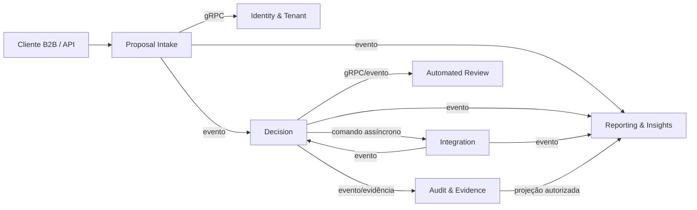

# Architecture Spine — CreditOS

## Design Paradigm

CreditOS usa **DDD + Hexagonal Architecture + Event-Driven Microservices**.

- Cada microsserviço representa um bounded context ou capacidade de domínio com linguagem e ownership próprios.
- O domínio fica isolado de frameworks, banco de dados, transporte, provedores externos e formatos de payload de terceiros.
- Entradas externas e internas chegam por adapters; casos de uso vivem na camada de aplicação; regras e invariantes vivem no domínio.
- Comunicação síncrona interna usa gRPC.
- Fluxos assíncronos usam NATS JetStream como backbone de referência.

## Invariants & Rules

### AD-1 — Paradigma arquitetural [ADOPTED]

- **Binds:** todos os serviços backend, contratos internos, integrações externas e persistência.
- **Prevents:** serviços acoplados por infraestrutura, domínio dependente de framework, microsserviços por camada técnica e divergência entre padrões síncronos/assíncronos.
- **Rule:** todo backend deve seguir DDD + Hexagonal Architecture + Event-Driven Microservices; domínio não depende de infraestrutura; gRPC cobre chamadas síncronas internas; NATS JetStream cobre fluxos assíncronos duráveis.

### AD-2 — Mapa de serviços e ownership de domínio/dados [ADOPTED]

- **Binds:** decomposição do primeiro deploy, ownership de dados, limites de comunicação e responsabilidades por serviço.
- **Prevents:** duplicidade de responsabilidade entre serviços, acesso direto a dados de outro domínio, serviço técnico sem fronteira de domínio e divergência na alocação de capacidades.
- **Rule:** o primeiro deploy possui exatamente sete microsserviços de domínio: `Identity & Tenant`, `Proposal Intake`, `Decision`, `Automated Review`, `Integration`, `Audit & Evidence` e `Reporting & Insights`. Cada serviço possui dados próprios e fronteiras explícitas. Comunicação cross-service só ocorre por gRPC, eventos NATS JetStream ou projeções autorizadas.



| Serviço | Ownership |
| --- | --- |
| `Identity & Tenant` | tenants, clientes técnicos, usuários, roles, permissões, claims, catálogo de tenant e tier de isolamento |
| `Proposal Intake` | submissão, schema, validação, normalização, idempotência, proposta recebida e status inicial |
| `Decision` | políticas, versões, execução determinística, decisão, códigos de motivo, inconclusivos e termos aprovados |
| `Automated Review` | revisão consultiva por IA, lacunas, inconsistências, guardrails e versões de agente/modelo |
| `Integration` | adapters externos, jobs assíncronos, fan-out/fan-in, retries, DLQ, fallback, resultados e custos de integração |
| `Audit & Evidence` | auditoria oficial, evidências, hash encadeado, checkpoints, exportação imutável e consultas auditáveis |
| `Reporting & Insights` | projeções, funil, dashboards, métricas de negócio, custos agregados e visão customer-facing curada |

## Structural Seed

```text
creditos/
  services/
    identity-tenant/
    proposal-intake/
    decision/
    automated-review/
    integration/
    audit-evidence/
    reporting-insights/
  packages/
    contracts/
    observability/
    security/
    testing/
  infra/
    iac/
    kubernetes/
```

## Deferred

- Stack de linguagem/framework backend.
- Topologia final AWS/EKS e sizing dos componentes.
- Detalhe de schemas físicos e migrations por serviço.
- Convenção final de pacotes, namespaces e estrutura de código.
- Lista completa de ADRs e ordem de execução.
